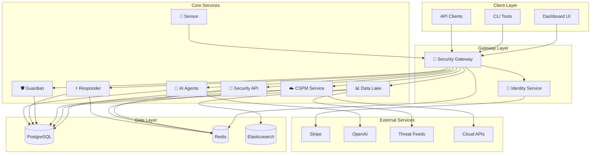
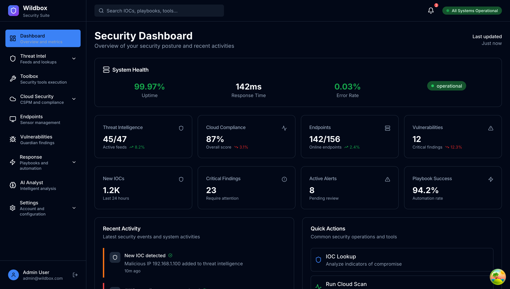

# 🛡️ Wildbox: The Open-Source Security Operations Suite

Wildbox is your all-in-one, self-hosted open-source security platform. It unifies threat monitoring, analysis, and automated response in one place, giving you full control over your data and infrastructure.

[](https://opensource.org/licenses/MIT)
[](https://docker.com)
[](https://python.org)
[](https://typescriptlang.org)

## As Seen On
[](https://selfh.st/weekly/2025-11-07/)
[](https://www.libhunt.com/r/wildbox)
[](https://dev.to/fab23/wildbox-all-in-one-open-security-platform-119h)

---

## What is Wildbox?

With Wildbox, you can:
- 🔎 **Centralize** threat intelligence from over 50 sources.
- 🛡️ **Monitor** your cloud infrastructure security (CSPM).
- 🤖 **Automate** incident response with customizable playbooks.
- 🖥️ **Manage** vulnerabilities through a single dashboard.
- 📡 **Monitor** your endpoints for suspicious activity.
- 🧠 **Leverage AI** for threat analysis and report generation.

## ✨ Features at a Glance

| Icon | Feature | Description |
| :---: | :--- | :--- |
| 🚪 | **Intelligent API Gateway** | A single, secure entry point with rate-limiting and centralized authentication. |
| 🔐 | **Identity Management** | Manage users, teams, and access with RBAC and JWT. |
| ☁️ | **Cloud Security (CSPM)** | Scan AWS, Azure, and GCP for misconfigurations and compliance. |
| 🛡️ | **Vulnerability Management** | Scan, prioritize, and manage the lifecycle of vulnerabilities. |
| ⚡ | **Automated Response (SOAR)** | Execute YAML-based playbooks to automate incident response. |
| 🧠 | **AI Analysis** | Leverage LLMs to analyze threats and generate reports. |

## 🏗️ Architecture

Wildbox follows a modern microservices architecture. Each component is an independent service that communicates through a unified API gateway.



## Screenshot



---

## 📋 Table of Contents

- [⚡ Quick Start (5 minutes)](#-quick-start-5-minutes)
- [🎯 Platform Overview](#-platform-overview)
- [🚀 Components](#-components)
- [🛠️ Technology Stack](#️-technology-stack)
- [� Community & Roadmap](#-community--roadmap)
- [🤝 Contributing](#-contributing)
- [📖 Documentation](#-documentation)
- [📄 License](#-license)

---

## ⚡ Quick Start (5 minutes)

**Get Wildbox running in 5 minutes with Docker Compose!**

```bash
# 1. Clone the repository
git clone https://github.com/fabriziosalmi/wildbox.git
cd wildbox

# 2. Create environment file (copy example)
cp .env.example .env
# IMPORTANT: Edit .env and generate a secure API_KEY and other secrets.
# Example for API_KEY: openssl rand -hex 32

# 3. Start all services
docker-compose up -d

# 4. Wait for services to start (can take 2-3 minutes)
sleep 180
curl http://localhost:8000/health

# 5. Access dashboard
# Frontend: http://localhost:3000
# API Docs: http://localhost:8000/docs
```

**For detailed setup instructions**, see:
- 📖 **[QUICKSTART.md](docs/guides/quickstart.md)** - Complete 5-minute guide with all steps
- 🔑 **[QUICKSTART_CREDENTIALS.md](docs/guides/credentials.md)** - Default credentials & API authentication
- 🛡️ **[SECURITY.md](docs/security/policy.md)** - Security configuration & best practices
- 🚀 **[DEPLOYMENT.md](docs/guides/deployment.md)** - Production deployment guide

---

## 🎯 Platform Overview

Wildbox is a **complete security operations platform** built from the ground up with modularity, scalability, and extensibility at its core. Each component operates as an independent microservice while seamlessly integrating to provide a unified security experience.

---

## 🚀 Components

### 🔐 **open-security-identity**
**The Authentication & Authorization Hub**

- **Purpose**: Centralized identity management, JWT authentication, API key management, and subscription billing
- **Technology**: FastAPI, PostgreSQL, Stripe, JWT

### 🚪 **open-security-gateway** 
**The Intelligent API Gateway**

- **Purpose**: Single entry point for all Wildbox services with advanced security and routing
- **Technology**: OpenResty (Nginx + Lua), Redis, Docker

### 🔧 **open-security-tools**
**The Security Toolbox**

- **Purpose**: Unified API for 50+ security tools with dynamic discovery and execution
- **Technology**: FastAPI, Redis, Docker

### 📊 **open-security-data**
**The Intelligence Repository**

- **Purpose**: Centralized threat intelligence aggregation and serving
- **Technology**: FastAPI, PostgreSQL, Elasticsearch, Redis

### ☁️ **open-security-cspm** (not implemented yet)
**The Cloud Security Posture Manager**

- **Purpose**: Multi-cloud security posture management and compliance scanning
- **Technology**: FastAPI, Celery, Redis, Python cloud SDKs

### 🛡️ **open-security-guardian**
**The Vulnerability Manager**

- **Purpose**: Comprehensive vulnerability lifecycle management with risk-based prioritization
- **Technology**: Django, PostgreSQL, Celery, Redis

### 📡 **open-security-sensor**
**The Endpoint Agent**

- **Purpose**: Lightweight endpoint monitoring and telemetry collection
- **Technology**: osquery, Python, HTTPS

### ⚡ **open-security-responder**
**The Automation Engine**

- **Purpose**: SOAR platform for incident response automation
- **Technology**: FastAPI, Dramatiq, Redis, YAML

### 🧠 **open-security-agents**
**The AI Brain**

- **Purpose**: AI-powered security analysis and automation
- **Technology**: FastAPI, Celery, LangChain, OpenAI

### 🖥️ **open-security-dashboard**
**The Command Center**

- **Purpose**: Unified web interface for the entire security platform
- **Technology**: Next.js, TypeScript, Tailwind CSS, TanStack Query

---

## 🛠️ Technology Stack

### 🖥️ **Frontend Technologies**
- **Next.js 14**: React framework with App Router and Server Components
- **TypeScript 5.0+**: Type-safe JavaScript with modern features
- **Tailwind CSS**: Utility-first CSS framework for rapid styling
- **Shadcn/ui**: High-quality React components built on Radix UI
- **TanStack Query**: Powerful data synchronization for React
- **Recharts**: Composable charting library for React
- **Lucide React**: Beautiful and customizable icon library

### ⚙️ **Backend Technologies**
- **FastAPI**: Modern, fast web framework for building APIs with Python
- **Django 5.0**: High-level Python web framework for rapid development
- **OpenResty**: High-performance web platform with Nginx and LuaJIT scripting
- **PostgreSQL 15**: Advanced open-source relational database
- **Redis 7**: In-memory data structure store for caching and queues
- **SQLAlchemy**: Python SQL toolkit and Object-Relational Mapping
- **Alembic**: Lightweight database migration tool for SQLAlchemy
- **Celery**: Distributed task queue for background processing

### 🧠 **AI & Machine Learning**
- **OpenAI GPT-4o**: Advanced language model for intelligent analysis
- **LangChain**: Framework for developing LLM-powered applications
- **Pydantic**: Data validation using Python type annotations
- **Jinja2**: Modern and designer-friendly templating language
- **NLTK**: Natural Language Toolkit for text processing
- **Scikit-learn**: Machine learning library for predictive analysis

### 🔧 **DevOps & Infrastructure**
- **Docker**: Containerization platform for consistent deployments
- **Docker Compose**: Multi-container Docker application orchestration
- **Nginx**: High-performance web server and reverse proxy
- **Prometheus**: Monitoring system and time series database
- **Grafana**: Analytics and interactive visualization platform
- **GitHub Actions**: CI/CD platform for automated testing and deployment

### 🛡️ **Security Technologies**
- **JWT (JSON Web Tokens)**: Secure authentication token standard
- **bcrypt**: Password hashing function for secure storage
- **python-jose**: JavaScript Object Signing and Encryption for Python
- **cryptography**: Cryptographic recipes and primitives for Python
- **osquery**: SQL-based host monitoring and endpoint visibility
- **TLS 1.3**: Latest Transport Layer Security protocol

---

## 🚀 Community & Roadmap

**Current Status: Early Evaluation Phase**

Wildbox is ready for community evaluation. We need your feedback to improve the platform.

### 📋 Roadmap

**Phase 1: Evaluation & Stabilization** (Current)
- ✅ Core security controls implemented
- ✅ Comprehensive documentation created
- 🔄 Community feedback and issue resolution (IN PROGRESS)

**Phase 2: Feature Expansion** (Based on Community Demand)
- 📋 Additional cloud provider integrations
- 📋 Extended SOAR automation capabilities
- 📋 Advanced threat intelligence integration

**Phase 3: Enterprise Hardening**
- 📋 High-availability and clustering
- 📋 Compliance certifications (SOC 2, ISO 27001)
- 📋 Commercial support and SLA options

---

## 🤝 Contributing

We welcome contributions from the security community! Please see our **[Contributing Guide](CONTRIBUTING.md)** for details on how to get started, our development process, and what we are looking for.

---

## 📖 Documentation

> 🌐 **Complete documentation available online**: Visit **[Wildbox Documentation Site](https://www.wildbox.io)** for the full documentation with organized guides, security reports, and deployment procedures.

For more details, see the following documents:
- **[QUICKSTART.md](docs/guides/quickstart.md)** - 5-minute rapid deployment guide.
- **[SECURITY_STATUS.md](docs/security/status.md)** - Current security status and vulnerability metrics.
- **[DEPLOYMENT.md](docs/guides/deployment.md)** - Production deployment guide.

---

## 📄 License

Wildbox is licensed under the **MIT License**. See the [LICENSE](LICENSE) file for details.

---

## 📞 Support & Contact

- **Issues**: Report bugs on [GitHub Issues](https://github.com/fabriziosalmi/wildbox/issues).
- **Discussions**: Join the [GitHub Discussions](https://github.com/fabriziosalmi/wildbox/discussions).
- **Security**: Email fabrizio.salmi@gmail.com for security vulnerabilities.