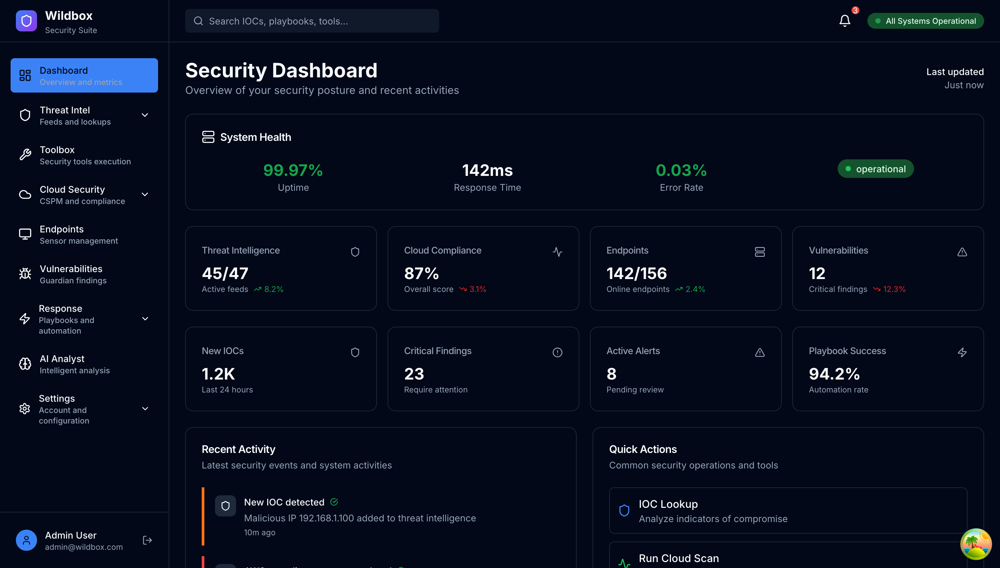
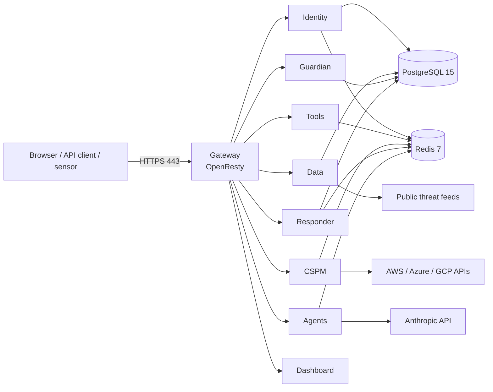

<div align="center">
  

# Wildbox

Self-hosted, open-source security operations platform.

[](LICENSE)
[](https://github.com/fabriziosalmi/wildbox/actions/workflows/test.yml)
[](https://github.com/fabriziosalmi/wildbox/actions/workflows/integration-tests.yml)
[](https://github.com/fabriziosalmi/wildbox/releases)

[Documentation](https://www.wildbox.io/docs.html) · [Quick start](#quick-start) · [Changelog](CHANGELOG.md) · [Security policy](SECURITY.md)

</div>

Wildbox runs threat intelligence, cloud posture checks, vulnerability tracking,
security tooling and automated response as a set of services behind one
authenticating gateway, on your own hardware, with your data staying there.

Wildbox is pre-1.0. Interfaces can change between minor releases; read
[UPGRADING.md](UPGRADING.md) before moving to a new version.



## Capabilities

| Area | What it does | Service |
| :--- | :--- | :--- |
| Gateway | Single HTTPS entry point: authentication, per-IP and per-team rate limiting, routing | `open-security-gateway` |
| Identity | Users, teams, roles, API keys with scopes, JWT sessions with server-side revocation | `open-security-identity` |
| Security tools | 52 tools behind one API (DNS, TLS, email security, headers, ports, and more) | `open-security-tools` |
| Threat intelligence | Indicator collection from 7 public feeds (abuse.ch, PhishTank, AbuseIPDB and others) and lookup | `open-security-data` |
| Cloud posture | 31 checks: 22 for AWS against live accounts; Azure and GCP checks currently run on sample data | `open-security-cspm` |
| Vulnerabilities | Asset inventory, findings, risk-based prioritization, remediation tracking | `open-security-guardian` |
| Response | YAML playbooks executed as background jobs | `open-security-responder` |
| Endpoint telemetry | osquery-based telemetry from hosts running the sensor | `open-security-sensor` |
| Analysis | Threat-enrichment reports generated with Anthropic Claude | `open-security-agents` |
| Interface | Web dashboard | `open-security-dashboard` |

## Architecture

Every request from outside enters through the gateway. Backend services listen
on `127.0.0.1` only, PostgreSQL and Redis publish no port at all, and each
backend rejects requests that do not carry the gateway's proof-of-origin
secret.


```mermaid
flowchart LR
    client[Browser / API client / sensor] -->|HTTPS 443| gateway[Gateway<br/>OpenResty]
    gateway --> identity[Identity]
    gateway --> tools[Tools]
    gateway --> data[Data]
    gateway --> cspm[CSPM]
    gateway --> guardian[Guardian]
    gateway --> responder[Responder]
    gateway --> agents[Agents]
    gateway --> dashboard[Dashboard]
    identity --> pg[(PostgreSQL 15)]
    data --> pg
    guardian --> pg
    responder --> pg
    identity --> redis[(Redis 7)]
    tools --> redis
    cspm --> redis
    responder --> redis
    agents --> redis
    agents --> claude[Anthropic API]
    cspm --> clouds[AWS / Azure / GCP APIs]
    data --> feeds[Public threat feeds]
```

## Quick start

### Requirements

- Docker Engine 24 or later with the Compose plugin (`docker compose`)
- 8 GB of RAM (16 GB recommended), 20 GB of free disk
- Linux, macOS, or Windows with WSL 2

### Install and start

```bash
git clone https://github.com/fabriziosalmi/wildbox.git
cd wildbox

make generate-secrets        # writes .env with random values for every secret (mode 0600)
# edit INITIAL_ADMIN_EMAIL in .env: it is the login of the first administrator
make validate-secrets        # refuses placeholder values

docker compose up -d --wait  # builds and starts the stack; the first build takes several minutes
```

This is the configuration the integration suite starts and tests on every
change.

### Verify

The gateway serves HTTPS with a certificate generated at first start. Trust it
explicitly rather than disabling verification:

```bash
curl --cacert open-security-gateway/ssl/wildbox.crt https://localhost/health
```

Log in with the initial administrator. The email is the one you set in `.env`;
the password was generated there by `make generate-secrets`:

```bash
ADMIN_EMAIL=$(sed -n 's/^INITIAL_ADMIN_EMAIL=//p' .env)
ADMIN_PASSWORD=$(sed -n 's/^INITIAL_ADMIN_PASSWORD=//p' .env)

TOKEN=$(curl -s --cacert open-security-gateway/ssl/wildbox.crt \
  --data-urlencode "username=$ADMIN_EMAIL" \
  --data-urlencode "password=$ADMIN_PASSWORD" \
  https://localhost/auth/jwt/login | python3 -c 'import json,sys; print(json.load(sys.stdin)["access_token"])')

curl --cacert open-security-gateway/ssl/wildbox.crt \
  -H "Authorization: Bearer $TOKEN" https://localhost/api/v1/tools
```

Open the dashboard at `https://localhost` and sign in with the same account.
Change the initial password after the first login.

### Optional services

| Service | Start with |
| :--- | :--- |
| Workflow automation (n8n) | `docker compose --profile automations up -d` |
| Prometheus | `docker compose --profile monitoring up -d` |
| Scheduled backups | `docker compose --profile backup up -d` |

## Operations

| Task | Command |
| :--- | :--- |
| Service status | `docker compose ps` |
| Logs | `docker compose logs -f <service>` |
| Full health check | `make health` |
| Production overlay | `make start-prod` (adds `docker-compose.prod.yml`) |
| Back up PostgreSQL | `make backup` |
| Rehearse a restore | `make restore-drill` |
| List rotatable secrets | `make rotate-secrets` |
| Stop | `docker compose down` |

Ports, service names and bindings are listed in one place:
[ports reference](https://www.wildbox.io/guides/ports/). Production guidance is in the
[deployment guide](https://www.wildbox.io/guides/deployment/).

## Security

- Report vulnerabilities privately as described in [SECURITY.md](SECURITY.md).
- The current state of known security issues, including what is still open, is
  published on the [security status page](https://www.wildbox.io/security/status/).
- Every Python service ships a hash-pinned lockfile compiled from
  `requirements.in`; CI blocks pull requests that introduce a critical
  advisory, and a daily job reports any found on `main`.

## Development

```bash
make lock             # recompile every service's hash-pinned requirements.txt
make lock-security    # move only packages with known advisories
make test             # integration tests against a running stack
```

Unit tests run per service; see `.github/workflows/test.yml` for the exact
commands CI uses. Contribution guidelines: [CONTRIBUTING.md](CONTRIBUTING.md).
Engineering documents (architecture decisions, testing strategy, service
lifecycle) are indexed on the [contributor docs](https://www.wildbox.io/contributing/) page.

## Documentation

| Topic | Link |
| :--- | :--- |
| Documentation portal | [wildbox.io/docs.html](https://www.wildbox.io/docs.html) |
| Quick start (detailed) | [guides/quickstart](https://www.wildbox.io/guides/quickstart/) |
| Credentials and authentication | [guides/credentials](https://www.wildbox.io/guides/credentials/) |
| API reference | [wildbox.io/api](https://www.wildbox.io/api/) |
| Upgrading between versions | [UPGRADING.md](UPGRADING.md) |
| Troubleshooting | [TROUBLESHOOTING.md](TROUBLESHOOTING.md) |

## Support

- Bugs and feature requests: [GitHub Issues](https://github.com/fabriziosalmi/wildbox/issues)
- Questions: [GitHub Discussions](https://github.com/fabriziosalmi/wildbox/discussions)
- Commercial support, deployment and consulting: fabrizio.salmi@gmail.com

## License

[MIT](LICENSE)
