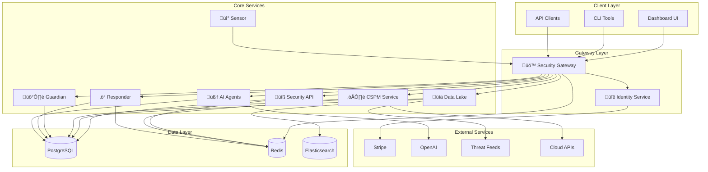

# 🛡️ Wildbox Open Security Platform

**The Complete Open-Source Security Operations Suite**

A comprehensive, modular, and scalable open-source security platform designed for modern cybersecurity operations. Wildbox provides enterprise-grade security tools, threat intelligence, cloud security posture management (CSPM), vulnerability management, endpoint monitoring, automated response, and AI-powered analysis through a unified architecture with intelligent API gateway.

[](https://opensource.org/licenses/MIT)
[](https://docker.com)
[](https://python.org)
[](https://typescriptlang.org)

## As Seen On
[](https://selfh.st/weekly/2025-11-07/)
[](https://www.libhunt.com/r/wildbox)
[](https://dev.to/fab23/wildbox-all-in-one-open-security-platform-119h)

## Screenshot


---

## 📋 Table of Contents

- [🎯 Platform Overview](#-platform-overview)
- [⚡ Quick Start (5 minutes)](#-quick-start-5-minutes)
- [🏗️ Architecture](#️-architecture)
- [🚀 Components](#-components)
- [✨ Key Features](#-key-features)
- [🐳 Docker Deployment](#-docker-deployment)
- [🛠️ Development](#️-development)
- [📊 Service Ports](#-service-ports)
- [🔗 Integration](#-integration)
- [📖 Documentation](#-documentation)
- [🤝 Contributing](#-contributing)
- [📄 License](#-license)

---

## ⚡ Quick Start (5 minutes)

**Get Wildbox running in 5 minutes with Docker Compose!**

```bash
# 1. Clone the repository
git clone https://github.com/fabriziosalmi/wildbox.git
cd wildbox

# 2. Create environment file (copy example)
cp .env.example .env
# Edit .env and add your configuration (optional for development)

# 3. Start all services
docker-compose up -d

# 4. Wait for services to start (check health)
sleep 10
curl http://localhost:8000/health

# 5. Access dashboard
# Frontend: http://localhost:3000
# API Docs: http://localhost:8000/docs
```

**For detailed setup instructions**, see:
- 📖 **[QUICKSTART.md](QUICKSTART.md)** - Complete 5-minute guide with all steps
- 🔑 **[QUICKSTART_CREDENTIALS.md](QUICKSTART_CREDENTIALS.md)** - Default credentials & API authentication
- 🛡️ **[SECURITY.md](SECURITY.md)** - Security configuration & best practices
- 🚀 **[DEPLOYMENT.md](DEPLOYMENT.md)** - Production deployment guide

---

## 🚀 Community & Roadmap

**Current Status: Early Evaluation Phase**

Wildbox has completed comprehensive security hardening and is ready for community evaluation and feedback. The platform includes all core security components with enterprise-grade controls, but reaches **community maturity through community contributions, bug reports, and real-world usage**.

### 🤝 We Need Community Input On:

**Feedback & Ideas**
- [ ] Feature requests and use case suggestions
- [ ] Workflow improvements and usability feedback
- [ ] Integration requests (new tools, platforms, services)
- [ ] Performance observations and optimization ideas
- [ ] Security assessments and penetration testing results

**Bug Reports & Issues**
- [ ] Functional bugs and edge cases
- [ ] Compatibility issues (OS, Python, Node versions)
- [ ] Documentation improvements and clarifications
- [ ] Error messages and logging enhancements
- [ ] Performance issues and bottlenecks

**Code Contributions**
- [ ] New security tools and detections
- [ ] Cloud provider integrations (AWS, Azure, GCP, etc.)
- [ ] Additional SOAR playbooks and automation workflows
- [ ] Dashboard improvements and new visualizations
- [ ] Language translations and localization

**Operational Experience**
- [ ] Deployment experiences and best practices
- [ ] Scalability feedback from larger deployments
- [ ] Resource optimization in different environments
- [ ] Monitoring and alerting improvements
- [ ] Backup and disaster recovery procedures

### 📋 Roadmap

**Phase 1: Evaluation & Stabilization** (Current)
- ✅ Core security controls implemented
- ✅ Comprehensive documentation created
- 🔄 Community feedback and issue resolution (IN PROGRESS)
- 🔄 Real-world usage validation (IN PROGRESS)
- 📋 Performance tuning based on feedback

**Phase 2: Feature Expansion** (Based on Community Demand)
- 📋 Additional cloud provider integrations
- 📋 Extended SOAR automation capabilities
- 📋 Advanced threat intelligence integration
- 📋 Custom plugin/extension framework
- 📋 Multi-tenancy support

**Phase 3: Enterprise Hardening** (Requires Community Maturity)
- 📋 High-availability and clustering
- 📋 Compliance certifications (SOC 2, ISO 27001)
- 📋 Commercial support and SLA options
- 📋 Advanced analytics and reporting
- 📋 API versioning and stability guarantees

### 🎯 How to Help

1. **Test & Report Issues**: Deploy Wildbox, find bugs, report them
2. **Suggest Features**: Share your security use cases and needs
3. **Contribute Code**: Fix bugs, add features, improve documentation
4. **Share Feedback**: Tell us what works and what doesn't
5. **Spread the Word**: Help grow the community

**See [Contributing](#-contributing) section for detailed guidelines.**

---

## 📈 Data Ingestion Workflows

Wildbox now includes a powerful set of over 30 data ingestion workflows, designed to populate the Wildbox Datalake with a wide array of open-source security intelligence. These workflows are the first step in building a comprehensive, in-house threat intelligence repository.

### Key Features:

- **Manual & Automated Execution**: Currently, all workflows are triggered manually via `workflow_dispatch`, allowing you to refresh data on demand. In the near future, these will be automated to run on a schedule.
- **Comprehensive Data Coverage**: The workflows cover a vast range of security data, including threat intelligence, vulnerability databases, compliance benchmarks, OSINT, and more.
- **Ready for Integration**: The collected data is stored in a structured format within the `datalake/raw/` directory, ready to be processed and integrated with the Wildbox Data Service.
- **Future Enhancements**: We will be publishing scripts and automations to process this raw data, providing aggregated and enriched intelligence, both with and without the use of AI.

For a complete list and documentation of all available workflows, please see the **[Workflow Documentation](.github/workflows/README.md)**.

---

## 🎯 Platform Overview

Wildbox is a **complete security operations platform** built from the ground up with modularity, scalability, and extensibility at its core. Each component operates as an independent microservice while seamlessly integrating to provide a unified security experience.

## 🛠️ Technology Stack

### 🖥️ **Frontend Technologies**
- **Next.js 14**: React framework with App Router and Server Components
- **TypeScript 5.0+**: Type-safe JavaScript with modern features
- **Tailwind CSS**: Utility-first CSS framework for rapid styling
- **Shadcn/ui**: High-quality React components built on Radix UI
- **TanStack Query**: Powerful data synchronization for React
- **Recharts**: Composable charting library for React
- **Lucide React**: Beautiful and customizable icon library

### ⚙️ **Backend Technologies**
- **FastAPI**: Modern, fast web framework for building APIs with Python
- **Django 5.0**: High-level Python web framework for rapid development
- **OpenResty**: High-performance web platform with Nginx and LuaJIT scripting
- **PostgreSQL 15**: Advanced open-source relational database
- **Redis 7**: In-memory data structure store for caching and queues
- **SQLAlchemy**: Python SQL toolkit and Object-Relational Mapping
- **Alembic**: Lightweight database migration tool for SQLAlchemy
- **Celery**: Distributed task queue for background processing

### 🧠 **AI & Machine Learning**
- **OpenAI GPT-4o**: Advanced language model for intelligent analysis
- **LangChain**: Framework for developing LLM-powered applications
- **Pydantic**: Data validation using Python type annotations
- **Jinja2**: Modern and designer-friendly templating language
- **NLTK**: Natural Language Toolkit for text processing
- **Scikit-learn**: Machine learning library for predictive analysis

### 🔧 **DevOps & Infrastructure**
- **Docker**: Containerization platform for consistent deployments
- **Docker Compose**: Multi-container Docker application orchestration
- **Nginx**: High-performance web server and reverse proxy
- **Prometheus**: Monitoring system and time series database
- **Grafana**: Analytics and interactive visualization platform
- **GitHub Actions**: CI/CD platform for automated testing and deployment

### 🛡️ **Security Technologies**
- **JWT (JSON Web Tokens)**: Secure authentication token standard
- **bcrypt**: Password hashing function for secure storage
- **python-jose**: JavaScript Object Signing and Encryption for Python
- **cryptography**: Cryptographic recipes and primitives for Python
- **osquery**: SQL-based host monitoring and endpoint visibility
- **TLS 1.3**: Latest Transport Layer Security protocol

---

## 📊 Monitoring & Observability

### 📈 **Built-in Monitoring**
- **Health Checks**: Automated health monitoring for all services
- **Metrics Collection**: Prometheus metrics for performance monitoring
- **Centralized Logging**: Structured logging with log aggregation
- **Real-time Dashboards**: Grafana dashboards for system visibility
- **Alerting**: Automated alerts for critical events and failures

### 🔍 **Monitoring Endpoints**
```bash
# Health checks for all services
curl http://localhost:8000/health    # Security API
curl http://localhost:8001/health    # Identity Service
curl http://localhost:8002/health    # Data Lake
curl http://localhost:8013/health    # Guardian
curl http://localhost:8004/health    # Sensor
curl http://localhost:8018/health    # Responder
curl http://localhost:8006/health    # AI Agents
curl http://localhost:8019/health    # CSPM

# Metrics endpoints
curl http://localhost:8000/metrics   # Prometheus metrics
curl http://localhost:9090           # Prometheus UI
curl http://localhost:3001           # Grafana dashboard
```

### 📊 **Key Performance Indicators (KPIs)**
- **API Response Time**: Average response time across all endpoints
- **Throughput**: Requests per second for each service
- **Error Rate**: Percentage of failed requests
- **Resource Utilization**: CPU, memory, and disk usage
- **Queue Length**: Background task queue depth
- **Active Users**: Concurrent authenticated users
- **Threat Detection Rate**: Number of threats detected per hour

### 🚨 **Alerting Rules**
- **High CPU Usage**: > 80% for 5 minutes
- **High Memory Usage**: > 90% for 3 minutes
- **API Errors**: > 5% error rate for 2 minutes
- **Database Connections**: > 80% of max connections
- **Disk Space**: < 10% free space remaining
- **Service Unavailable**: Health check failures

---

## 🔧 Advanced Configuration

### 🔐 **Security Configuration**
```yaml
# security-config.yml
authentication:
  jwt:
    algorithm: "HS256"
    expiration: 3600  # 1 hour
    refresh_expiration: 604800  # 7 days
  
  api_keys:
    encryption: "sha256"
    rate_limiting: true
    expiration_days: 365

authorization:
  rbac:
    enabled: true
    roles: ["owner", "admin", "member", "viewer"]
  
  rate_limiting:
    requests_per_minute: 100
    burst_size: 20

security_headers:
  hsts: true
  csp: "default-src 'self'"
  frame_options: "DENY"
  content_type_options: "nosniff"
```

### 🌐 **Network Configuration**
```yaml
# network-config.yml
networking:
  load_balancer:
    type: "nginx"
    ssl_termination: true
    health_checks: true
  
  service_mesh:
    enabled: false
    mtls: true
    circuit_breaker: true
  
  firewall:
    allow_ports: [80, 443, 8000-8006]
    deny_by_default: true
    
monitoring:
  prometheus:
    scrape_interval: "15s"
    retention: "15d"
  
  logging:
    level: "INFO"
    format: "json"
    rotation: "daily"
```

### 🗄️ **Database Configuration**
```yaml
# database-config.yml
postgresql:
  max_connections: 100
  shared_buffers: "256MB"
  effective_cache_size: "1GB"
  maintenance_work_mem: "64MB"
  checkpoint_completion_target: 0.9
  
  backup:
    enabled: true
    retention_days: 30

redis:
  # Consolidated Redis instance for all services
  maxmemory: "512MB"
  maxmemory_policy: "allkeys-lru"
  save: "900 1 300 10 60 10000"
  databases: 16  # Logical separation per service
  
  # Service database allocation:
  # 0: Identity Service
  # 1: Guardian Service  
  # 2: Responder Service
  # 3: CSPM Service
  # 4: AI Agents Service
  # 5: Gateway Service
  # 6: API Service
  # 7: Data Service
  
  cluster:
    enabled: false
    replicas: 1
```

### 🚀 **Redis Optimization**

Wildbox uses a **consolidated Redis architecture** for improved efficiency:

- **Single Redis Instance**: Reduced from 8 containers to 1
- **Memory Efficiency**: 512MB total vs ~2GB previously  
- **Logical Separation**: Database 0-15 for service isolation
- **Simplified Operations**: Unified backup, monitoring, and management
- **Better Performance**: Reduced container overhead and improved caching
```

---

## 🚨 Troubleshooting Guide

### 🔍 **Common Issues**

#### **Service Won't Start**
```bash
# Check service logs
docker-compose logs [service-name]

# Verify port availability
netstat -tulpn | grep [port]

# Check system resources
docker system df
docker stats
```

#### **Database Connection Issues**
```bash
# Test database connectivity
docker exec -it wildbox-postgres psql -U wildbox -d wildbox -c "SELECT 1;"

# Check database logs
docker-compose logs postgres

# Verify database configuration
cat .env | grep DATABASE_URL
```

#### **Authentication Problems**
```bash
# Verify API key configuration
curl -H "Authorization: Bearer YOUR_API_KEY" http://localhost:8001/api/v1/auth/verify

# Check JWT token validity
python -c "import jwt; print(jwt.decode('YOUR_TOKEN', verify=False))"

# Reset authentication
docker-compose exec identity python manage.py reset-auth
```

#### **High Memory Usage**
```bash
# Check memory usage by service
docker stats --format "table {{.Container}}\t{{.CPUPerc}}\t{{.MemUsage}}"

# Optimize Redis memory
docker exec -it wildbox-redis redis-cli CONFIG SET maxmemory-policy allkeys-lru

# Clear application caches
curl -X POST http://localhost:8000/admin/cache/clear
```

### 🛠️ **Debug Mode Setup**
```bash
# Enable debug mode for all services
export DEBUG=true
export LOG_LEVEL=DEBUG

# Start services with debug configuration
docker-compose -f docker-compose.debug.yml up -d

# View detailed logs
docker-compose logs -f --tail=100
```

### 📋 **Health Check Commands**
```bash
# Comprehensive health check script
#!/bin/bash
echo "🔍 Wildbox Health Check"
echo "======================"

services=("dashboard:3000" "security-api:8000" "identity:8001" "data-lake:8002" "guardian:8013" "sensor:8004" "responder:8018" "agents:8006" "cspm:8019" "automations:5678")

for service in "${services[@]}"; do
    name=$(echo $service | cut -d: -f1)
    port=$(echo $service | cut -d: -f2)
    
    if curl -s http://localhost:$port/health > /dev/null; then
        echo "✅ $name is healthy"
    else
        echo "❌ $name is unhealthy"
    fi
done

# Check dependencies
echo ""
echo "🔗 Dependencies:"
if docker exec wildbox-postgres pg_isready > /dev/null 2>&1; then
    echo "✅ PostgreSQL is ready"
else
    echo "❌ PostgreSQL is not ready"
fi

if docker exec wildbox-redis redis-cli ping > /dev/null 2>&1; then
    echo "✅ Redis is ready"
else
    echo "❌ Redis is not ready"
fi
```

---


## 🔮 Advanced Use Cases

### 🧠 **AI-Powered Security Operations**

#### **Automated Threat Hunting**
```yaml
# threat-hunting-playbook.yml
name: "AI-Powered Threat Hunt"
description: "Automated threat hunting using AI analysis"

triggers:
  - type: "schedule"
    cron: "0 */6 * * *"  # Every 6 hours

steps:
  - name: "collect_indicators"
    action: "data.query"
    params:
      query: "SELECT * FROM indicators WHERE confidence > 80"
      limit: 1000

  - name: "ai_analysis"
    action: "ai.analyze_batch"
    params:
      indicators: "{{collect_indicators.results}}"
      analysis_type: "threat_hunting"

  - name: "generate_report"
    action: "ai.generate_report"
    params:
      analysis: "{{ai_analysis.results}}"
      template: "threat_hunting_report"

  - name: "alert_analysts"
    action: "notifications.slack"
    params:
      channel: "#threat-hunting"
      message: "New threat hunting report available: {{generate_report.url}}"
```

#### **Intelligent Incident Classification**
```python
# Custom AI classifier for security incidents
from wildbox.ai import SecurityClassifier

classifier = SecurityClassifier(
    model="gpt-4o",
    training_data="incident_history.json"
)

# Classify new incidents automatically
incident = {
    "title": "Suspicious network activity detected",
    "description": "Multiple failed login attempts from foreign IP",
    "indicators": ["192.168.1.100", "admin", "ssh"]
}

classification = classifier.classify(incident)
# Result: {"severity": "high", "category": "brute_force", "confidence": 0.92}
```

### 🌐 **Multi-Cloud Security Orchestration**

#### **Cross-Cloud Compliance Monitoring**
```yaml
# cloud-compliance-monitoring.yml
name: "Multi-Cloud Compliance Check"
description: "Monitor compliance across AWS, Azure, and GCP"

triggers:
  - type: "schedule"
    cron: "0 8 * * MON"  # Weekly on Monday

steps:
  - name: "scan_aws"
    action: "cloud.scan"
    params:
      provider: "aws"
      frameworks: ["cis", "nist", "soc2"]

  - name: "scan_azure"
    action: "cloud.scan"
    params:
      provider: "azure"
      frameworks: ["cis", "nist", "soc2"]

  - name: "scan_gcp"
    action: "cloud.scan"
    params:
      provider: "gcp"
      frameworks: ["cis", "nist", "soc2"]

  - name: "aggregate_results"
    action: "compliance.aggregate"
    params:
      scans: ["{{scan_aws.id}}", "{{scan_azure.id}}", "{{scan_gcp.id}}"]

  - name: "generate_dashboard"
    action: "reporting.dashboard"
    params:
      data: "{{aggregate_results}}"
      template: "multi_cloud_compliance"
```

### 🔍 **Advanced Threat Intelligence**

#### **Threat Actor Attribution**
```python
# Advanced threat attribution using multiple intelligence sources
from wildbox.threat_intel import ThreatAttributor

attributor = ThreatAttributor(
    sources=["mitre_attack", "threat_groups", "malware_families"],
    ai_enhancement=True
)

# Analyze attack patterns for attribution
attack_data = {
    "techniques": ["T1566.001", "T1053.005", "T1055.012"],
    "iocs": ["bad-domain.com", "malware.exe", "192.168.1.100"],
    "timeline": "2024-01-15T10:30:00Z"
}

attribution = attributor.analyze(attack_data)
# Result: {
#   "likely_groups": ["APT29", "FIN7"],
#   "confidence": 0.85,
#   "techniques_overlap": 0.78,
#   "geographic_indicators": ["Russia", "Eastern Europe"]
# }
```

---


### 🔒 **Security Best Practices**

#### **Deployment Security**
```bash
# Generate strong passwords and API keys
openssl rand -base64 32

# Use environment variables for secrets
export WILDBOX_API_KEY=$(openssl rand -hex 32)
export JWT_SECRET=$(openssl rand -hex 64)

# Enable TLS/SSL for all communications
./scripts/setup-ssl.sh --domain your-wildbox.company.com

# Configure firewall rules
ufw allow 22/tcp    # SSH
ufw allow 80/tcp    # HTTP (redirect to HTTPS)
ufw allow 443/tcp   # HTTPS
ufw deny 8000:8010/tcp  # Block direct service access
```

#### **Network Security**
```yaml
# network-security.yml
firewall:
  deny_by_default: true
  allowed_ports:
    - 22    # SSH (admin access only)
    - 80    # HTTP redirect
    - 443   # HTTPS

  ip_whitelist:
    - "10.0.0.0/8"      # Internal networks
    - "192.168.0.0/16"  # Private networks
    - "your.office.ip"   # Office IP address

rate_limiting:
  enabled: true
  requests_per_minute: 100
  burst_size: 20
  
intrusion_detection:
  enabled: true
  block_suspicious_ips: true
  alert_threshold: 5
```

---

## 🏗️ Architecture

Wildbox follows a modern microservices architecture with clear separation of concerns and well-defined APIs. Each component is designed to be independently deployable, scalable, and maintainable.

### 🔄 **System Architecture**



### 🔌 **Service Communication**

| Service | Port | Protocol | Authentication |
|---------|------|----------|---------------|
| **Dashboard** | 3000 | HTTP/HTTPS | JWT + Session |
| **API Gateway** | 80/443 | HTTP/HTTPS | API Key + JWT |
| **Identity Service** | 8001 | HTTP | Internal + JWT |
| **Security API** | 8000 | HTTP | API Key |
| **Data Lake** | 8002 | HTTP | API Key |
| **Guardian** | 8013 | HTTP | API Key |
| **Sensor** | 8004 | HTTPS | Certificate |
| **Responder** | 8018 | HTTP | API Key |
| **AI Agents** | 8006 | HTTP | API Key |

### 🛡️ **Security Architecture**

#### **Authentication Flow**
1. **User Registration/Login** → Identity Service issues JWT
2. **API Key Creation** → Team-scoped API keys for service access
3. **Request Authorization** → Gateway validates with Identity Service
4. **Service Access** → Authenticated requests forwarded to services

#### **Authorization Matrix**

| Role | Dashboard | API Access | Team Management | Billing |
|------|-----------|-------------|-----------------|---------|
| **Owner** | ✅ Full | ✅ Full | ✅ Full | ✅ Full |
| **Admin** | ✅ Full | ✅ Full | ✅ Limited | ❌ None |
| **Member** | ✅ Limited | ✅ Limited | ❌ None | ❌ None |
| **Viewer** | ✅ Read-only | ✅ Read-only | ❌ None | ❌ None |

---

## 🚀 Components

### 🔐 **open-security-identity**
**The Authentication & Authorization Hub**

- **Purpose**: Centralized identity management, JWT authentication, API key management, and subscription billing
- **Technology**: FastAPI, PostgreSQL, Stripe, JWT
- **Key Features**:
  - User registration and authentication
  - Team management with RBAC
  - API key lifecycle management
  - Stripe integration for subscriptions
  - Rate limiting and permissions

```bash
# Start Identity Service
cd open-security-identity
docker-compose up -d

# Access: http://localhost:8001
# API Docs: http://localhost:8001/docs
```

### 🚪 **open-security-gateway** 
**The Intelligent API Gateway**

- **Purpose**: Single entry point for all Wildbox services with advanced security and routing
- **Technology**: OpenResty (Nginx + Lua), Redis, Docker
- **Key Features**:
  - Centralized authentication and authorization
  - Plan-based feature gating (Free/Personal/Business/Enterprise)
  - Dynamic rate limiting with Lua scripting
  - SSL/TLS termination with security headers
  - Intelligent caching and request routing
  - Real-time monitoring and logging

```bash
# Start Gateway
cd open-security-gateway
make start

# Access: https://wildbox.local
# Health: https://wildbox.local/health
# Features: Unified entry point for all services
```

### 🔧 **open-security-tools**
**The Security Toolbox**

- **Purpose**: Unified API for 50+ security tools with dynamic discovery and execution
- **Technology**: FastAPI, Redis, Docker
- **Key Features**:
  - Dynamic tool discovery and loading
  - Async tool execution with timeout handling
  - Schema validation and documentation
  - Web interface and API endpoints

```bash
# Start Security API
cd open-security-tools
make dev

# Access: http://localhost:8000
# Tools: 50+ security tools available
```

### 📊 **open-security-data**
**The Intelligence Repository**

- **Purpose**: Centralized threat intelligence aggregation and serving
- **Technology**: FastAPI, PostgreSQL, Elasticsearch, Redis
- **Key Features**:
  - 50+ threat intelligence sources
  - Real-time data collection and processing
  - IOC lookup and enrichment
  - Geolocation and reputation scoring

```bash
# Start Data Lake
cd open-security-data
docker-compose up -d

# Access: http://localhost:8002
# Sources: 50+ threat intelligence feeds
```

### ☁️ **open-security-cspm** (not implemented yet)
**The Cloud Security Posture Manager**

- **Purpose**: Multi-cloud security posture management and compliance scanning
- **Technology**: FastAPI, Celery, Redis, Python cloud SDKs
- **Key Features**:
  - Multi-cloud support (AWS, Azure, GCP)
  - 200+ security checks across cloud providers
  - Compliance frameworks (CIS, NIST, SOC2, PCI-DSS)
  - Risk-based prioritization and scoring
  - Automated remediation recommendations
  - Executive dashboards and reporting

```bash
# Start CSPM Service
cd open-security-cspm
make start

# Access: http://localhost:8019
# Features: Cloud security scanning, compliance monitoring
```

### 🛡️ **open-security-guardian**
**The Vulnerability Manager**

- **Purpose**: Comprehensive vulnerability lifecycle management with risk-based prioritization
- **Technology**: Django, PostgreSQL, Celery, Redis
- **Key Features**:
  - Asset discovery and inventory
  - Multi-scanner integration
  - Risk-based vulnerability prioritization
  - Compliance framework support
  - Remediation workflow automation

```bash
# Start Guardian
cd open-security-guardian
docker-compose up -d

# Access: http://localhost:8013
# Features: Vulnerability management, compliance monitoring
```

### 📡 **open-security-sensor**
**The Endpoint Agent**

- **Purpose**: Lightweight endpoint monitoring and telemetry collection
- **Technology**: osquery, Python, HTTPS
- **Key Features**:
  - Cross-platform endpoint monitoring
  - Real-time telemetry collection
  - Centralized configuration management
  - Encrypted data transmission

```bash
# Deploy Sensor
cd open-security-sensor
./scripts/deploy-agent.sh

# Monitor: Real-time endpoint telemetry
```

### ⚡ **open-security-responder**
**The Automation Engine**

- **Purpose**: SOAR platform for incident response automation
- **Technology**: FastAPI, Dramatiq, Redis, YAML
- **Key Features**:
  - YAML-based playbook definition
  - Async workflow execution
  - External system integrations
  - Real-time execution monitoring

```bash
# Start Responder
cd open-security-responder
docker-compose up -d

# Access: http://localhost:8018
# Features: Playbook automation, workflow orchestration
```

### 🧠 **open-security-agents**
**The AI Brain**

- **Purpose**: AI-powered security analysis and automation
- **Technology**: FastAPI, Celery, LangChain, OpenAI
- **Key Features**:
  - GPT-4 powered threat analysis
  - Automated report generation
  - Natural language querying
  - Tool orchestration via AI

```bash
# Start AI Agents
cd open-security-agents
docker-compose up -d

# Access: http://localhost:8006
# Features: AI-powered analysis, automated insights
```

### 🖥️ **open-security-dashboard**
**The Command Center**

- **Purpose**: Unified web interface for the entire security platform
- **Technology**: Next.js, TypeScript, Tailwind CSS, TanStack Query
- **Key Features**:
  - Real-time security dashboards
  - Multi-service integration
  - Role-based access control
  - Modern responsive UI

```bash
# Start Dashboard
cd open-security-dashboard
npm run dev

# Access: http://localhost:3000
# Features: Unified security operations center
```

---


## 🛠️ Development

### Development Environment Setup

```bash
# Clone the repository
git clone https://github.com/fabriziosalmi/wildbox.git
cd wildbox

# Create virtual environment (Python services)
python3 -m venv venv
source venv/bin/activate  # Linux/Mac
# or
venv\Scripts\activate  # Windows

# Install dependencies
pip install -r requirements.txt

# For frontend development
cd open-security-dashboard
npm install
npm run dev
```

### Running Tests

```bash
# Run all tests
docker-compose exec [service] pytest

# Run with coverage
docker-compose exec [service] pytest --cov=app

# Run specific test file
docker-compose exec [service] pytest tests/test_auth.py
```

### Development Guidelines

- Follow PEP 8 for Python code
- Use TypeScript for frontend code
- Write unit tests for new features
- Update documentation with changes
- Sign commits with GPG when possible

---

## 📊 Service Ports

| Service | Port | Purpose | Access URL |
|---------|------|---------|------------|
| **Dashboard** | 3000 | Frontend UI | http://localhost:3000 |
| **Security API** | 8000 | Security tools API | http://localhost:8000 |
| **Identity** | 8001 | Authentication service | http://localhost:8001 |
| **Data Lake** | 8002 | Threat intelligence | http://localhost:8002 |
| **Guardian** | 8013 | Vulnerability management | http://localhost:8013 |
| **Responder** | 8018 | Incident response | http://localhost:8018 |
| **AI Agents** | 8006 | AI analysis engine | http://localhost:8006 |
| **API Gateway** | 80/443 | Request routing | http://localhost |
| **PostgreSQL** | 5432 | Database (internal) | localhost:5432 |
| **Redis** | 6379 | Cache (internal) | localhost:6379 |
| **Prometheus** | 9090 | Metrics UI | http://localhost:9090 |
| **Grafana** | 3001 | Monitoring dashboards | http://localhost:3001 |
| **n8n** | 5678 | Workflow automation | http://localhost:5678 |

---

## 🔗 Integration

### API Integration

Wildbox provides comprehensive APIs for integration with external systems:

```bash
# Example: Call security analysis API
curl -X POST http://localhost:8000/v1/analyze \
  -H "Authorization: Bearer YOUR_TOKEN" \
  -H "Content-Type: application/json" \
  -d '{"data": "your data here"}'

# Example: Execute playbook
curl -X POST http://localhost:8018/v1/playbooks/1/execute \
  -H "Authorization: Bearer YOUR_TOKEN" \
  -H "Content-Type: application/json" \
  -d '{"params": {}}'
```

### Webhook Integration

Configure webhooks for automated workflows:

```yaml
webhooks:
  slack:
    enabled: true
    url: https://hooks.slack.com/services/YOUR/WEBHOOK/URL
    events: ["incident_created", "alert_triggered"]
  
  teams:
    enabled: false
    url: https://outlook.webhook.office.com/webhookb2/...
    events: ["incident_critical"]
```

### External Tool Connectors

- **Slack** - Notifications and incident updates
- **Microsoft Teams** - Alerts and reports
- **Jira** - Issue tracking integration
- **ServiceNow** - Incident management
- **Splunk** - Log analysis integration
- **Elasticsearch** - Distributed search

---

## 📖 Documentation

> 🌐 **Complete documentation available online**: Visit **[Wildbox Documentation Site](https://www.wildbox.io)** for the full documentation with organized guides, security reports, and deployment procedures.
>
> This README contains the main documentation files. The `/docs` folder provides an organized structure for GitHub Pages hosting.

### Quick Start & Setup

- **[QUICKSTART.md](QUICKSTART.md)** - 5-minute rapid deployment guide
  - Prerequisites and installation
  - Service startup verification
  - Quick reference commands
  
- **[QUICKSTART_CREDENTIALS.md](QUICKSTART_CREDENTIALS.md)** - Credentials reference
  - Default user accounts
  - API authentication setup
  - Token management
  - Security best practices for credentials

### Security & Compliance

**🚀 Start here for security information:**

- **[SECURITY_STATUS.md](SECURITY_STATUS.md)** ⭐ **Current Security Status**
  - All 7 verification checks (PASS/FAIL results)
  - Vulnerability metrics & 66% reduction achieved
  - 19 issues fixed vs remaining at a glance
  - Transitive dependency monitoring plan
  - Quick reference table of all issues

**For different security needs:**

- **[SECURITY.md](SECURITY.md)** - Complete security policy (v2.0)
  - Security requirements before production
  - Authentication & authorization configuration
  - Network security hardening
  - Dependency vulnerability management
  - Incident response procedures
  - Bug bounty program details

- **[SECURITY_IMPROVEMENTS_SUMMARY.md](SECURITY_IMPROVEMENTS_SUMMARY.md)** - Executive overview
  - Vulnerability metrics (29 → 10 achieved)
  - All improvements implemented
  - Timeline and achievements
  - Community feedback opportunities

- **[SECURITY_AUDIT_REPORT.md](SECURITY_AUDIT_REPORT.md)** - Deep technical analysis
  - Each vulnerability explained in detail
  - Code examples of issues and fixes
  - OWASP/CWE mappings
  - For security engineers and auditors

- **[SECURITY_FINDINGS.json](SECURITY_FINDINGS.json)** - CI/CD Format
  - Machine-readable vulnerability data
  - For automation and build pipelines
  - Structured metrics and tracking

### Deployment & Operations

- **[DEPLOYMENT.md](DEPLOYMENT.md)** - Production deployment guide (649 lines)
  - Infrastructure setup and hardening
  - Secret management procedures
  - Database initialization
  - Service deployment steps
  - SSL/TLS configuration
  - Monitoring and alerting setup
  - Backup and recovery procedures
  - Troubleshooting guide

### Architecture & Design

- **[Architecture Documentation](Architecture.md)** - System design
  - Component interactions
  - Data flow diagrams
  - Integration patterns

---

## 🤝 Contributing

We welcome contributions from the security community! In the current evaluation phase, we especially need:

### 🔥 High Priority Contributions (Evaluation Phase)

**Testing & Feedback** (No coding required)
- [ ] Deploy Wildbox and share your experience
- [ ] Test different deployment scenarios (Docker, cloud, on-premise)
- [ ] Try various security integrations and workflows
- [ ] Report bugs and edge cases you discover
- [ ] Suggest features based on your security needs
- [ ] Performance testing in different environments

**Issues & Bug Reports**
- [ ] Compatibility issues (OS, Python, Node versions)
- [ ] Documentation gaps or unclear sections
- [ ] Error messages that need improvement
- [ ] Configuration options that are confusing
- [ ] Performance bottlenecks you discover

**Real-World Feedback**
- [ ] Share your deployment architecture
- [ ] Document security use cases you implement
- [ ] Suggest integrations with your tools
- [ ] Provide scaling feedback (10, 100, 1000+ events/sec)
- [ ] Report operational issues and solutions

### Code Contribution Process

1. **Fork** the repository on GitHub
2. **Create** a feature branch: `git checkout -b feature/my-feature`
3. **Make** your changes with clear, descriptive commits
4. **Test** your changes thoroughly
5. **Push** to your fork: `git push origin feature/my-feature`
6. **Create** a Pull Request with detailed description

### Contribution Areas

**Easy Wins for New Contributors**
- [ ] Documentation improvements and clarifications
- [ ] README translations to other languages
- [ ] Additional example configurations
- [ ] Docker Compose variations for different scenarios
- [ ] Helpful scripts and automation
- [x] **API Documentation** - Document service endpoints ([Contributing Guide](docs/api/CONTRIBUTING.md))
  - [x] Guardian Service API endpoints and examples
  - [x] Agents Service AI analysis endpoints
  - [x] Data Service aggregation endpoints
  - [x] Tools Service execution endpoints
  - [x] Responder Service playbook endpoints
  - [ ] CSPM Service cloud security endpoints

**Medium-Level Contributions**
- [ ] New SOAR playbook examples
- [ ] Additional threat intelligence sources
- [ ] Cloud provider integrations (starter)
- [ ] Dashboard improvements and visualizations
- [ ] API client libraries in different languages

**Advanced Contributions**
- [ ] Multi-tenancy support
- [ ] High-availability clustering
- [ ] Advanced analytics features
- [ ] Custom authentication backends
- [ ] Performance optimizations

### Security Contributions

Found a security vulnerability?

**Please report security issues privately:**
- Email: fabrizio.salmi@gmail.com
- Do NOT create public GitHub issues for security vulnerabilities
- Include: description, reproduction steps, impact assessment
- Allow 48 hours for initial response

### Code Style

- **Python**: Follow PEP 8, use Black for formatting
- **TypeScript**: Follow ESLint configuration, use Prettier
- **Commits**: Use clear, descriptive messages
- **Documentation**: Update relevant docs with changes
- **Tests**: Include tests for new features

### Testing Requirements

- Unit tests for all new code
- Integration tests for API changes
- E2E tests for user-facing features
- Maintain >80% code coverage

### Getting Help with Contributions

- **Questions?** Ask in [GitHub Discussions](https://github.com/fabriziosalmi/wildbox/discussions)
- **Feature Ideas?** Post in [Discussions > Ideas](https://github.com/fabriziosalmi/wildbox/discussions/categories/ideas)
- **Found a Bug?** Create an [Issue](https://github.com/fabriziosalmi/wildbox/issues) with details
- **Want to Help?** Check [open issues](https://github.com/fabriziosalmi/wildbox/issues) marked as `help-wanted`

---

## 📄 License

Wildbox Open Security Platform is licensed under the **MIT License**.

### MIT License Summary

Permission is hereby granted, free of charge, to any person obtaining a copy of this software and associated documentation files (the "Software"), to deal in the Software without restriction, including without limitation the rights to use, copy, modify, merge, publish, distribute, sublicense, and/or sell copies of the Software, and to permit persons to whom the Software is furnished to do so, subject to the following conditions:

- The above copyright notice and this permission notice shall be included in all copies or substantial portions of the Software.
- THE SOFTWARE IS PROVIDED "AS IS", WITHOUT WARRANTY OF ANY KIND.

For full license text, see [LICENSE](LICENSE) file.

### Third-Party Licenses

Wildbox uses open-source components with the following licenses:
- **FastAPI**: MIT License
- **Django**: BSD License
- **PostgreSQL**: PostgreSQL License
- **Redis**: BSD License
- **React/Next.js**: MIT License
- See [THIRD_PARTY_LICENSES.md](THIRD_PARTY_LICENSES.md) for complete list

---

## 📞 Support & Contact

### Getting Help

- **Documentation**: See [📖 Documentation](#-documentation) section above
- **Issues**: Report bugs on [GitHub Issues](https://github.com/fabriziosalmi/wildbox/issues)
- **Discussions**: Join [GitHub Discussions](https://github.com/fabriziosalmi/wildbox/discussions)
- **Security**: Email fabrizio.salmi@gmail.com for security issues

### Community

- **GitHub**: https://github.com/fabriziosalmi/wildbox
- **Issues**: https://github.com/fabriziosalmi/wildbox/issues
- **Discussions**: https://github.com/fabriziosalmi/wildbox/discussions

---

## 📊 Project Status

**Version**: v0.1.2
**Status**: 🔄 Early Evaluation Phase
**Last Updated**: November 7, 2024
**Maintenance**: Active Development
**Maturity**: Ready for Community Testing & Feedback

### Current Focus

- Security hardening ✅ Complete
- Documentation ✅ Complete
- Community testing & feedback 🔄 IN PROGRESS
- Bug fixes & stabilization 🔄 IN PROGRESS
- Performance optimization 📋 Based on feedback

---

**Built with ❤️ for the security community**

*Wildbox is an open-source security platform dedicated to helping organizations and communities to protect their infrastructure and data.*

